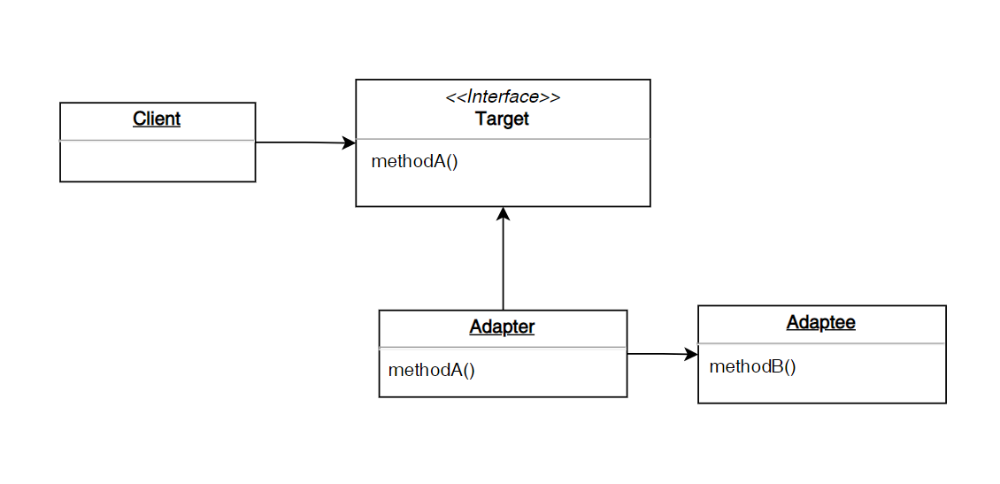
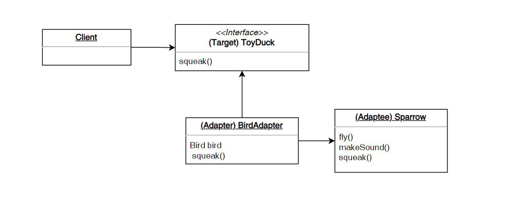

# 어댑터 패턴


> 디자인 패턴은 개발 과정 중 문제 해결/요구사항 처리하는 효과적인 방식을 패턴화한 것이다. 스프링 디자인 패턴은 상속/인터페이스/컴포지션(객체를 속성으로 사용)을 사용한다.
>

## 어댑터 패턴이란

<aside>

        🌟 호환되지 않는 여러 클래스들을 연관지어 일관되게 동작하게 하기 위해 어댑터 인터페이스를 사용한다.

</aside>

- 사용 이유?
    - 호환되지 않는 클래스들끼리 공통 인터페이스를 구현하여, 일관되게 동작하게 한다. 이로 인해 클라이언트 코드가 간단해진다.
    - 어떤 클래스가 상속받은 인터페이스 구조를 바꾸기 힘든 경우, 기존 코드를 적게 변경하면서 새로운 인터페이스를 구현하게 한다.
- 동작 (JDBC 예시)
    - 클라이언트는 Target 인터페이스(`JDBC`)에 의존한다.
    - 이 Target 인터페이스를 Adapter 클래스가 구현한다.
    - Adapter 클래스가 Adaptee 인스턴스를 감싼다. 이로 인해 Adaptee 인스턴스는 Target 인터페이스를 구현한다.
    - 기존 클래스들, 즉 Adaptee 클래스들(`Oracle/MySQL JDBC Driver`)은 Target 인터페이스(`JDBC`)의 메소드들을 각자에 맞게 오버라이딩한다. 
    - 따라서 Adaptee 클래스들(`Oracle/MySQL JDBC Driver`)은 서로 연관성이 없지만, 일관되게 동작한다.
    - 클라이언트는 Target 인터페이스에 의존하고, 필요에 따라 Adaptee 를 바꿔 사용한다.

  
- 예시
    - 대표적인 예시로 JDBC가 있다. JDBC 인터페이스는 다양한 DBMS를 구현체만 바꾸어 사용하는 공통 인터페이스이다.
    - [예시 참고](https://www.geeksforgeeks.org/adapter-pattern/?ref=gcse)
    - Bird를 구현한 Sparrow는 새롭게 ToyDuck의 기능을 구현하고 싶은 상황.

      

    1. `Sparrow`은 `Bird`인터페이스를 구현하는 클래스이다.

        ```java
        interface Bird
        {
            public void fly();
            public void makeSound();
        }
          
        class Sparrow implements Bird
        {
            public void fly()
            {
                System.out.println("Flying");
            }
            public void makeSound()
            {
                System.out.println("Chirp Chirp");
            }
        }
        ```

    2. 이때, `Sparrow`이 `ToyDuck`인터페이스를 구현하게 하고 싶다. (`ToyDuck` 의 기능을 갖게 하고 싶기 때문)

        ```java
        interface ToyDuck
        {
            // target interface
            public void squeak();
        }
        
        Sparrow sparrow = new Sparrow();
        
        // sparrow을 birdAdapter로 감싸서
        // ToyDuck의 동작을 수행하게 한다.
        ToyDuck birdAdapter = new BirdAdapter(sparrow);
        ```

    3. `ToyDuck` 인터페이스를 구현하는 `BirdAdapter`을 만든다. `BirdAdapter`가 감싸는 `Adaptee`는 `ToyDuck` 기능도 수행한다.

        ```java
        class BirdAdapter implements ToyDuck
        {
            Bird bird;
            public BirdAdapter(Bird bird)
            {
                this.bird = bird; // adaptee
            }
          
            public void squeak()
            {
                bird.makeSound();
            }
        }
        ```

    4. `BirdAdapter`로 감싸지는 `Adaptee`는 `Target` 인터페이스를 사용할 수 있다. 이러한 방식으로 Adapter 패턴을 사용하면 연관없는 클래스들도 공통 인테페이스(`Target` )를 가지게된다.

        ```java
        Sparrow sparrow = new Sparrow();
        
        // Adaptee(sparrow)를 birdAdapter로 감싸서
        // ToyDuck의 동작을 수행하게 한다.
        ToyDuck birdAdapter = new BirdAdapter(sparrow);
        ```


**Reference**

- [https://www.geeksforgeeks.org/adapter-pattern/?ref=gcse](https://www.geeksforgeeks.org/adapter-pattern/?ref=gcse)
- [https://johngrib.github.io/wiki/pattern/adapter/](https://johngrib.github.io/wiki/pattern/adapter/)