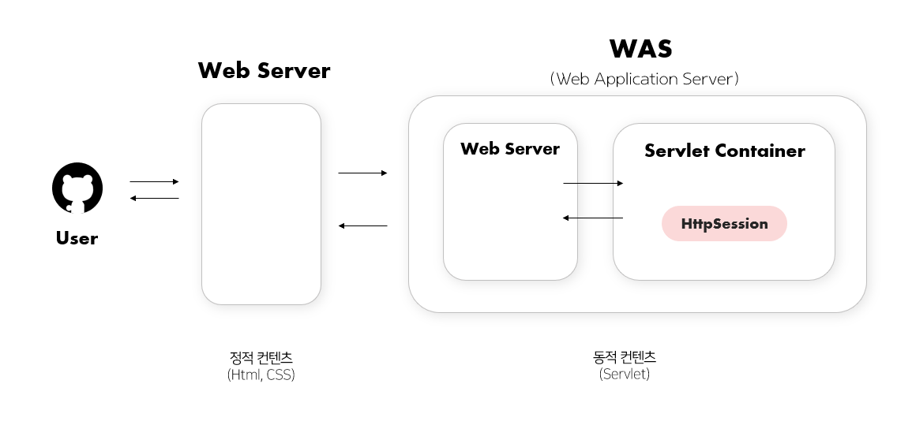

# 1. 로그인 구현/유지 with 쿠키, 세션

> 스프링으로 로그인 구현하는 방식과 로그인 상태를 유지하는 방식들(쿠키/세션)을 정리해보았다. 이 글에서는 우선 Spring Security 없이 구현하였고, 이후의 글에서 Security로도 구현할 예정이다.


### 로그인 구현하기 - 코드

다음은 로그인 구현하는 코드의 일부로, [김영한님 < 스프링 MVC 2편 - 백엔드 웹 개발 활용 기술 >강의를](https://www.inflearn.com/course/%EC%8A%A4%ED%94%84%EB%A7%81-mvc-2/dashboard) 참고하였다.

아이디와 비번을 입력 받고 해당 아이디의 비번이 DB와 일치하면 로그인이 성공한다. 로그인 성공하면 메인 페이지 (/)로 이동, 실패하면 다시 로그인 페이지(login/loginForm)로 이동한다. [전체 코드 (커밋)](https://github.com/f-lab-edu/book-club/commit/861f93f26266f9336b6e53ac6ddde5bfec8ac00c)

* **LoginController & LoginService**

```java
// LoginController 
@PostMapping("/login")
public String login(@Valid @ModelAttribute User inputUser, BindingResult result) {
    User loginUser = loginService.login(inputUser.getName(), inputUser.getPassword());
    
    if (loginUser == null) {
          result.reject("login fail", "name 혹은 password 오류");
          return "login/loginForm";
        }
      return "redirect:/";
    }

}

// LoginService
// 패스워드가 일치하면 User, 불일치하면 null 반환
    public User login(String name, String password) {
        Optional<User> findUser = userRepository.findByName(name);
        return findUser.filter(user->user.getPassword().equals(password))
                .orElse(null);
}
```

여기까지는 로그인 성공/실패 여부까지만 확인하는 코드이다. 이 상태라면, 유저가 한번 로그인하고 다른 페이지로 이동하면 **로그인 상태가 유지되지 않아, 다시 로그인해야 된다.** 페이지마다 매번 로그인을 시킬 수 없으니, 로그인 상태 유지하는 방법으로 쿠키나 세션을 사용한다.


### 로그인 상태 유지 : 쿠키와 세션

<figure><figcaption><p>쿠키와 세션의 저장 장소, 유저ID와 세션 ID</p></figcaption></figure>

쿠키와 세션의 동작 원리는 다른 글에서 정리하였다. [참고 링크](../../../network/cookie\_session.md)

둘의 가장 큰 차이점은 **저장 장소**이다. <mark style="background-color:yellow;">저장 장소의 차이가 보안의 차이로 이어진다.</mark>

* **쿠키는 브라우저의 쿠키 저장소에** 저장된다.
* **세션은 서버의 세션 저장소에** 저장되어 보안상 안전하다.

이 차이로 인해 로그인 상태를 유지하는 방식이 살짝 다르다. 쿠키와 세션으로 로그인 상태를 유지하는 방식은 다음과 같다.


#### **쿠키로 로그인 상태 유지**

1. 로그인 성공 시, 서버가 쿠키 발급 (유저ID 정보 있는 쿠키)
2. 이후부터는 클라이언트가 쿠키에 **유저ID**를 함께 전송함
3. 서버는 쿠키에 있는 유저ID가 로그인했다고 보고 이후 작업을 진행한다.

#### **세션으로 로그인 상태 유지**

1. 로그인 성공 시, 서버는 유저ID → **랜덤 변환값(세션 ID)로 암호화한다.** \
   (서버는 유저별 매핑된 세션ID를 저장하고 있다.)
2. 이후부터는 클라이언트가 쿠키에 **랜덤 변환값(세션 ID)**을 함께 전송함
3. 서버는 랜덤 변환값의 유저가 로그인했다고 보고 이후 작업을 진행한다.


쿠키는 유저ID 자체를 담은 쿠키를 전송한다. 쿠키에 유저ID만 담아 전송하면, 서버는 해당 유저로 로그인 되었다고 판단한다. 따라서 제 3자가 내 유저ID만 알면, 몰래 로그인할 수 있다. 정보가 클라이언트(브라우저) 측에만 저장되므로, 유저 ID를 변환(암호화)하면 서버가 이를 알 수 없다. 따라서 쿠키만으로는 유저ID 자체를 전송할 수밖에 없다. 따라서 보안이 떨어진다.

반면, **세션은 서버측에 유저ID와 매핑된 랜덤 변환값(세션ID)을 저장**해둔다. 클라이언트 측에서는 제 3자가 몰래 로그인하고 싶어도, 내 세션ID를 알 수 없다. 한번 로그인해야 유저ID → 세션 ID로 변환되기 때문이다. 따라서 진짜 로그인한 사람만 세션ID를 발급받는 다.이후부터 이 세션ID를 쿠키에 담아 전송하여 로그인 상태를 유지할 수 있다.


### 쿠키로 로그인 구현 - 코드

위에서 정리했듯이 로그인 성공 시 쿠키(유저 ID)에 발급하고, 이후부터는 쿠키의 유저ID로 로그인 여부를 정한다.

* **LoginController : 로그인 성공 시 쿠키 발급, 쿠키에는 유저ID**

```java
@Controller
@RequiredArgsConstructor
public class LoginController {
			// ...
	public String login(@Valid @ModelAttribute User inputUser, BindingResult result)
				// ...
        // 로그인 성공 시 쿠키 생성
        // 쿠키에 User 의 기본키 ID를 담음
        Cookie idCookie = new Cookie("userId", String.valueOf(loginUser.getId()));
        response.addCookie(idCookie);

        return "redirect:/";
    }
```

* **HomeController : 쿠키에 있는 유저ID로 로그인 상태 유지**

```java
@Controller
@RequiredArgsConstructor
public class HomeController {

    // 로그인 된 후 화면
    @GetMapping("/")
    public String homeLogin(@CookieValue(name = "userId", required = false) Long userId, Model model) {

        // 쿠키 없는 경우
        if (userId == null) {
            return "home";
        }

        // 쿠키 있는 경우 -> 실제 User 를 DB 에서 가져오기
        Optional<User> loginUser = userRepository.findById(userId);

        if (loginUser.isEmpty()) { // 실제 DB 에 있는 지 확인
            return "home";
        }

        User user = loginUser.get();

        //  user 객체를 모델에 담아서 전달
        model.addAttribute("user", user);
        return "loginHome";
    }
}
```





### 세션으로 로그인 구현 - 코드

위에서 정리했듯이 최초 로그인 성공 시 유저 ID -> 세션 ID로 암호화하고, 이후부터는 쿠키의 세션ID로 로그인 여부를 정한다. `HttpSession`으로 구현할 수도 있고, 직접 **SessionManager을 구현하여 직접** 세션을 만들 수도 있는 데 같은 로직이므로 필요에 따라 둘의 코드를 함께 가져와서 설명하였다.


* **HomeController** : 세션 ID로 로그인 상태를 검증한다.

```java
@Controller
@RequiredArgsConstructor
public class HomeController {
    @GetMapping("/")
    public String homeLoginHttpSession (HttpServletRequest request, Model model) {

        HttpSession session = request.getSession(false);
        if (session == null) {
            return "home";
        }

        User user = (User)session.getAttribute("login1");
        if (user == null) { // 실제 DB 에 있는 지 확인
            return "home";
        }

        //  user 객체를 모델에 담아서 전달
        model.addAttribute("user", user);
        return "loginHome";
    }
```

* **SessionManager** : 세션을 생성할 때 유저 ID를 랜덤 세션 ID로 암호화하는 코드는 다음과 같다.\
  (위 코드는 HttpSession을 상속받 세션을 구현한 코드였으나, 아래 코드는 **직접 SessionManager을 구현하여 직접 세션을 만들 경우**의 코드이다. 이 **SessionManager는** HttpSession와 같은 로직이다.)

<pre class="language-java"><code class="lang-java">@Component
public class SessionManager {
    public void createSession(Object value, HttpServletResponse response) {
    
        // 랜덤값 생성 (UUID)
        String sessionId = UUID.randomUUID().toString();
        sessionStore.put(sessionId, value);
	
        // 쿠키 생성                              쿠키 이름         sessionID
        Cookie mySessionCookie = new Cookie(SESSION_COOKIE_NAME, sessionId);
        response.addCookie(mySessionCookie);
    }
	
        // 세션 조회 - 쿠키 이름으로 조회해서 sessionId 꺼내기
        public Object getSession(HttpServletRequest request) {
            Cookie[] cookies = request.getCookies();
<strong>            if (cookies == null) {
</strong>                return null;
	    }
    
        for (Cookie cookie : cookies) {
            if (cookie.getName().equals(SESSION_COOKIE_NAME)) {
                return sessionStore.get(cookie.getValue());
	    }
	}
	    return null;
    }</code></pre>



SessionManager 직접 구현



HttpSession 상속받아 구현




지금까지는 쿠키나 세션이나 단일 서버 환경에서의 로그인 상황이었다. 만약 서비스가 커져서 Scale-up하게 되면(다중 서버), 로그인 세션은 어떻게 유지할 수 있을까?



이를 알려면 우선 **세션이 어디에 저장되는 지** 알아야 한다. 쿠키는 브라우저에 저장되지만, 세션은 구체적으로 서버의 어디에 저장될까?



### HttpSession은 서버의 어디에 저장될까?

<figure><figcaption><p>웹서버와 WAS - 세션 저장 위치</p></figcaption></figure>

세션으로 로그인 구현하기 -> 여기서 세션은 `HttpSession`을 상속받아 구현하였다. `HttpSession`은 자바에서 제공하는 **서블릿 api**이다. ( `javax.servlet.http.HttpSession` )

따라서 HttpSession은 WAS(Tomcat)의 메모리, 그 중에서도 **서블릿 컨테이너**에 Object 객체로 저장된다. 즉, <mark style="background-color:yellow;">서버의 메모리에 저장된다</mark>. 단일 서버에서는 유저의 세션 정보는 해당 메모리만 찾아보면 된다. 그러면 다중 서버에서는 어떻게 될까? 이는 다음 글에서 정리해보았다.


### 정리하면

> 로그인 구현 방식과 로그인 상태를 유지하는 쿠키와 세션에 대해 알아보았다. 쿠키와 세션의 **가장 큰 차이점은 저장 장소**였다. **저장 장소의 차이가 보안의 차이로 연결**된다.

> **쿠키**는 브라우저에만 저장되어, 유저ID를 통해서만 서버와 소통할 수 있다. 따라서 제 3자가 조작하여 쿠키에 내 유저ID를 담아 몰래 로그인 할 수 있다. 반면 **세션**은 서버에 저장되기 때문에 유저 ID를 한번 암호화한 세션 ID를 서버측에 저장해둔다. 로그인 상태를 확인할 때, 세션 ID를 사용한다. 제 3자가 내 유저 ID는 알아도 세션 ID는 모르기 때문에 몰래 로그인 할 수 없다. 로그인 상태 유지에는 쿠키가 아닌 보안상 안전한 세션을 사용한다.



여기까지의 로그인 구현은 단일 서버 환경을 가정한 상황이다. 세션은 서버의 메모리에 저장된다. 이때, 만약 다중 서버일 경우에는 로그인 상태를 유지할 수 있을까? 이를 다음 글에서 알아보았다.



