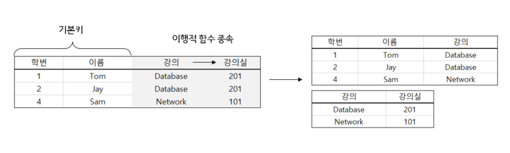

# RDB와 NoSQL의 차이 및 용도 비교

## NoSQL vs RDB 차이 비교


NoSQL은 일관성보다는 **확장성, 조회 성능**에 초점을 둔 데이터베이스 \
RDB는 **데이터 일관성**에 초점을 둔 데이터베이스



### 1. 정규화 → 중복 데이터 유무 → 조회 속도 차이

> RDB는 정규화를 통해 중복 데이터를 없앨 수 있으나,&#x20;
>
> NoSQL은 정규화X, 중복 데이터가 존재할 수 있음


**RDB의 정규화로 중복 데이터 제거하는 과정**

* **정규화** : 관계형 데이터베이스에서 **중복을 최소화**하기 위해 테이블을 분리하는 작업
* ex) **제 3 정규형 참고 -** 항상 Database 강의는 201 강의실, Network 강의는 101 강의실인 상황

<figure><figcaption><p><strong>제 3 정규형</strong></p></figcaption></figure>

* **정규화 전** : 테이블에 이행적 함수 종속이 존재 → 데이터 중복
* **정규화 후** : 강의별 강의실을 나타내는 테이블을 분리 → 데이터 중복이 발생하지 않고, 데이터 일관성이 유지
* **정규화 관련 참고** : [https://github.com/Cs-Java-Interview/Tech-Interview/blob/main/db/normalization.md](https://github.com/Cs-Java-Interview/Tech-Interview/blob/main/db/normalization.md)


**반면 NoSQL은 위와 같은 정규화 과정을 거치지 않기 때문에 위 예시의 왼쪽처럼 중복 데이터들이 발생한다. 만약 데이터들을 update해주어야 하면 중복 데이터들을 모두 업데이트 해주어야 하는 비효율적인 상황이 발생하게 된다..!**



**그러면 반드시 정규화 과정을 거치는 게 좋을 까?**\
\
정규화 과정을 거치면 테이블을 분리하는 과정이므로 테이블을 조회할 때는, **여러 테이블 간 조인하여 연산하는 경우가 많아지게 된다. 즉, 연산 시간이 늘어나게 된다.**

따라서 조인이 많이 발생하여 조회 속도가 느려지는 경우, **비정규화**를 거치기도 한다.



결론적으로,

**RDB**는 정규화를 거쳐 중복 데이터가 없다. 반면 조회 시, 조인해야 하므로 속도가 느려질 수 있다.

**NoSQL**은 중복 데이터들이 발생하여 update가 많은 경우 비효율적이다. 반면, 조회 시에는 조인하는 과정이 없으므로 속도가 빠르다.


### 2. 스키마 유연? → 수직 vs 수평 확장

> RDB는 스키마가 명확하여 수직 확장에 유리하고, \
> NoSQL은 스키마가 유연하여 수평 확장에 유리하다

데이터베이스 수직/수평 확장할 때 DBMS별로 유불리함을 알아보기 위해 관계 모델링 방식을 정리해보겠습니다. 우선 MongoDB은 MySQL과는 달리 관계 데이터를 저장할 때는 다음처럼 **임베디드나 래퍼런스**를 사용합니다.


1. **Embedded**

* 중복 데이터가 저장되어 update할 때 모든 데이터들 수정해주어야 함
* 일관성보단 조회 성능이 중요할 때 사용함
* 래퍼런스 키 테이블을 따로 조회하지 않아도 기존 테이블만 조회해보아도 가능

```
// User
{
   _id: 1,
   name: "",
   post: {
      _id: "1000",
      contents: ""
  }
}

// Post
{
   _id: "1000",
   contents: ""
}
```

2. **Reference**

* **래퍼런스 ID**를 사용하여 관계 모델링
* join이 되지 않기 때문에 래퍼런스 id를 조회 후에, 다시 해당 래퍼런스 id로 조회하는 2차 쿼리가 필요함
* 조회 성능보다는 일관성이 중요할 경우 사용함

```
// Post
{
   _id: "1000",
   contents: ""
}

// User
{
   _id: 1,
   name: "",
   post_id: "1000" // 래퍼런스 id!
}
```


* **수직 확장 (Scale-up) :** 기존 데이터베이스의 성능을 높이는 scale-up
* **수평 확장 (Scale-out) :** 데이터베이스의 수를 추가하는 scale-out으로, NoSQL은 쉽게 가능하나 RDB는 수평 확장이 까다롭다.

RDB의 경우(테이블 간 관계가 있을 경우), 만약 Scale-out을 하게 되면 조회 시 까다로운 과정을 거친다. 조회할 때 FK가 맺어진 다른 테이블을 조회하기 위해 여러 DB 서버를 다 찾아보아야 한다.

반면 NoSQL은 RDB처럼 테이블 간 관계를 통해 join하지 않기 때문에 분산에 용이하다. (NoSQL은 트랜잭션, ACID를 보장하지 않고 join대신 앞선 설명처럼 임베디드 혹은 래퍼런스 방식 사용한다.)


### 3. 트랜잭션 ACID vs BASE


